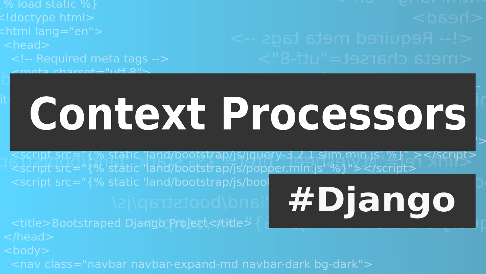

# Lesson 27 - Django's Context Processors

This project was created with following command::

    django-admin startproject --template https://github.com/ciur/django-bootstrap-project-template/archive/master.zip bookstore

Watch [Django Lessons screencast](https://django-lessons.com/pages/lessons/context-processors/)
